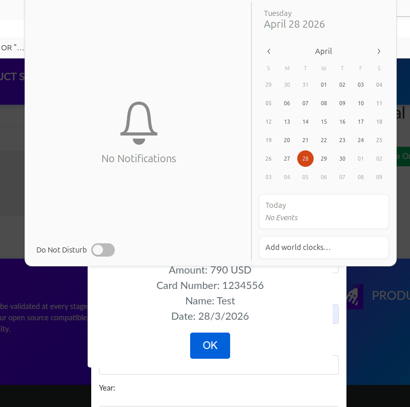

# Cypress E2E Test Suite - Demoblaze 

## Overview
This project is a Cypress E2E testing suite for web application https://www.demoblaze.com using:
- Page Object Model (POM)
- Fixtures for test data
- Support for multi-languages support and CI integration in the future
- Network intercepts
- Positive and negative login, purchase and essential shopping cart tests, created under a three days release tight deadline

## Prerequisites
- Node.js (20.x, 22.x, >=24.x)
- npm (>=10.1.0), yarn (>=1.22.22) or pnpm (>=8.x)

Full details on the system requirments and how to install are provided [in this link](https://docs.cypress.io/app/get-started/install-cypress#System-requirements). This README assumes the choice of npm from this point on.

## Cypress Installation
```bash
npm install cypress --save-dev
```

## Login to Demoblaze
Before running the tests if you want to use a different user account than mine, please make sure to sign up and update /fixtures/users.json file with your credentials

## Running the Cypress test suite
Clone this Github repo to your local machine then open your terminal and change directory to where you cloned the project, e.g.:
```bash
cd ~/Dev/Cypress/Demoblaze
```
In your terminal, you have different options of running the test suite as follows:

### Open Test Runner (UI)
```bash
npx cypress open
```
This will open the Cypress Test Runner and allows you to choose which browser to run against, changing options and which tesing scenarios to run.

### Run in Headless Mode
```bash
npx cypress run
```
This will run the whole test suite using the default configuration as per /cypress.config.js with the result displayed in your terminal.

### Environment config
You can override base URL, for example to run against Demoblaze web application locally. Also handy when running in CI/CD using environment variable to override the default base url (https://www.demoblazex.com/)
```bash
CYPRESS_baseUrl=http://localhost:1234 npx cypress run
```
Notice that the environment variables names need to begin with **CYPRESS_**.

### Runing a specific spec
Run the command with **-spec** followed by the file name, e.g.:
```bash
npx cypress run --spec cypress/e2e/login.cy.js
```

## Tests Included
Under the tight deadline of 3 days, I've done a quick risk based analysis,what the core functinality of and e-commerce company is, and created the minimum E2E test that I think the web application shouldn't be released if any of them fail. I've assumed that the current state of the web application is the desired state, which is something I wouldn't do in a real life siutation, as I would use the requirements instead (Please see the notes at the end of the README on exisitng and potential issues I've discovered in the web application).

### The test suite includes:
**Login tests:** 
- Positive: User can log in with valid credetials
- Negative: User cannot log in with wrong password and gets the correct error message
- Negative: User cannot log in with non-exisitng account and gets the correct error message

**Purchase tests**
- Positive: User is able to purchases multiple laptops, checking the process from beginning to end. Also checking the confirmation message at the end and the shopping cart is empty after making the purchase
- Positive: The product data is consitent between homepage and product details page, including product name, description and price
- Positive: The product data is consitent between product details and shopping cart pages, including product name and price
- Negative: User cannot purchase without entering a credit card number and gets the correct error message
- Negative: User cannot purchase without entering a name number and gets the correct error message

**Shopping cart tests**
- Positive: Confirms that total price of the products is calculated correctly
- Positive: Confirms deleting products from the shopping cart works as expected

## Best Practices Used
### Page Object Model (POM)
When designing the testing framework, I've POM design pattern and spent the longer time designing the page objects (found under /pages). This effort invetment pays off on the long run insuring:
- Maintainability: Changes to UI elements are confined to their page classes. Updating DOM selectors if needed in the future is done in one place (the page object) without touching the tests logic
- Reusability: Page methods can be reused across multiple test cases, minimizing code duplication and follows DRY principle.
- Readability: Test scripts focus on actions rather than technical implementation details. Someone who's not technical can follow the steps in the tests and check the business logic
- Structure: Organizes code, making it easier to manage large-scale automation projects. 

### Fixtures for reusable data
Data like user credentials and data for valid and invalid users can be updated in one place under /fixtures.

### Ready for localization
Although the current web application is currently only in Enlish, it's common that application support multiple languages in the future. The test suite is built ready to be extended for that in the future if needed. The strings used (e.g. checking for the correct alerts text) are not hardcoded in tests but rather in /fixtures/strings/en.json file. If in the future the application added support for another language interface - for example German - there would be no need to touch the exisitng tests. Rather make a copy of en.json to de.json, replace the English text with the German one, change `lang` in the configuration file /cypress.config.js to `de` and the tests will adapt to any new languages automatically, utilizing Cypress command I've added in /commands.js and how the tests were designed. That is also handy if the string changed in the current english string, since there's one place to updates.

### Tests neither depend on specific data nor other tests 
Tests will not break, if the data in the web application was changed as long as there are some products (the tests focus on laptops). Also the test don't depend on each others, rather every test runs independently. That limits flaky tests and follows the test design best practices.

### Network intercepts
A major reason for test instability is API calls that that a longer time than expected. To elemminate the this, I've used `cy.intercept()` for those calls and waited for the responses using a longer timeout interval, that can also be updated in slower environments by updating the value of `longCommandsTimeout` in cypress.config.js

## Important notes on the tests and Demoblaze
As mentioned above, I've created the tests based on the current web application state which is OK for the sake of a demo, but in real life, the requirements and the stories should be the source of truth to what to expect. Those issues I've spotted while writing the tests and in real life cenarios, I would discuss with the team before writing the tests:
- There's a clear bug in the purchase confirmation dialogue: The purchase data shows the previous rather than the current month. This bug causes the `Purchases multiple laptops beginning to end` to fail (as it should). If you'd like to skip that check for now and make the test pass, please comment the last line in `PlaceOrderPage.assertPurchaseConfirmation(amount)`. I've also added comments in the code for that.

- There are country and city fields in the place order form but no address! And also those fields are not mandatory. Where would those purchased items be delivered? I would definitely confirm that with the team in a real life scenario.
- The web app allows purchasing without entering the month and year in the Place order form, which I assume for credit card expiry. The error message in the alert also mention only the missing credit card number, so I assume it's by design. In most real life apps, credit card number is not enough without those though, so I would double check the requirements document and if needed, I would discuss with the team and add tests for checking those too.
- The web application doesn't check credit card format while purchasing
- I've noticed that User can make a purchase without logging in, I went along with it when designing the the tests but I would confirm that with the requirements and the PM and add a test for that if needed, in a real life scenario.
- Some element selectors are not the best. In real scenario, I would talk to the developers to add better ones for those, eg. id or data test attributes. With the current test framework design, it's easy to update the locators in one place on the top of the page object file.
